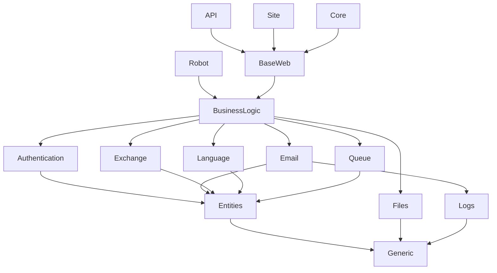

# C# Project Structure

```mermaid
graph TD

  %% Satellite
  API --> BaseWeb
  Robot --> BusinessLogic
  Site --> BaseWeb

  %% Core
  Entities --> Generic
  Files --> Generic
  Logs --> Generic

  Authentication --> Entities
  Email --> Entities
  Email --> Logs
  Exchange --> Entities
  Language --> Entities
  Queue --> Entities

  BusinessLogic --> Authentication
  BusinessLogic --> Email
  BusinessLogic --> Exchange
  BusinessLogic --> Files
  BusinessLogic --> Language
  BusinessLogic --> Queue

  BaseWeb --> BusinessLogic

  Core --> BaseWeb
```
